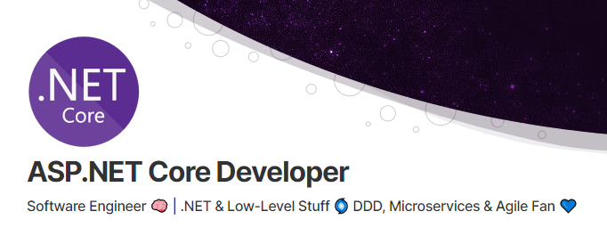

# Hi there, I'm Zenith W 👋

## .Net Developer with 9+ years of experience 

I am a technical leader and full-stack developer with over nine years of hands-on experience creating microservices, APIs, and web applications.
I possess a broad knowledge of the Microsoft technology stack, including C#, .NET Core, and ASP.NET. I am familiar with microservies architecture and cloud-based solutions (Microsoft Azure). While working primarily in the industrial area, I have learned how to deliver critical software systems that are highly available, secure, and fast.
My personal passion lies within high-performance solutions, complex technical challenges, and algorithm implementation and optimization.

I am proficient in .Net core and .Net Framework based development and have over 9 years of experience.

Currently, I have been developing the project with the current latest version, .Net Framework 4.8 or .Net Core 6 and setting it up to handle automated testing and automated deployment via CI/CD.

## Employment

### Senior Software Developer

Eternix : 2015.8 ~ 2018.8

✅ Developed a leading real-time visualization software on .NET in C# from scratch.

✅ Built a real-time application of traditionally offline modules and algorithms (reprojection, visible areas, clustering, etc.).

✅ Involved broadly in all stages of development, including requirements analysis, software architecture, implementation, and deployment.

✅ Led the development of custom-tailored software solutions, following specific client needs during the development process and beyond.

✅ Researched and developed real-time GIS and image processing algorithms as well as 3D graphics using shaders at DirectX, OpenGL, and CUDA.

✅ Designed complex real-time, multi-threaded applications, solving and overcoming various technological challenges.

Technologies: REST, Object-oriented Programming (OOP), Continuous Integration (CI), IPC, Design Patterns, PostGIS, Entity Framework, Project Planning, Technical Project Management, Cache, Performance, Video Streaming, 3D Graphics, Windows Communication Framework (WCF), Concurrent Programming, RESTful Development, RESTful APIs, API Integration, Team Leadership, Streaming, .NET, C#.NET WinForms, Algorithms, API Architecture, Git, Azure App Service, SQL, Test-driven Development (TDD), REST APIs, ASP.NET MVC, CUDA, GIS, DirectX, OpenGL, PostgreSQL, MySQL, Azure, ASP.NET, C++, C#

### Senior Software Developer

Storone : 2019.6 ~ 2022.4

✅ Researched, designed, and implemented a complex, distributed, real-time cache module, using C and C#, both on Windows and Linux (Mono) platforms.

✅ Designed and implemented ultra-high-performance, concurrent, custom tailored data-structures.

✅ Developed and designed a hardware monitoring system in both Windows and Linux.

✅ Researched and integrated experimental SW and HW infrastructure solutions into the existing system.

Technologies: Object-oriented Programming (OOP), IPC, Design Patterns, Entity Framework, Project Planning, Technical Project Management, Cache, Performance, Windows Communication Framework (WCF), Concurrent Programming, Distributed Computing, Team Leadership, .NET, Algorithms, API Architecture, Git, Test-driven Development (TDD), iWARP, TCP/IP, Remote Direct Memory Access (RDMA), Mono, C#, C

## Education

UCR: University of California, Riverside 2011 ~ 2014

## Skills

C#, .NET Core, .NET Framework, .NET Stack, ASP.NET, ASP.NET Core, ASP.NET MVC, ELK Stack, Azure DevOps, Microsoft Visual Studio, Git, Jira, Slack, Web Development

### Languages
C#, C#.NET, SQL, JavaScript, C++, GraphQL, GLSL, ASP.NET Razor, TypeScript, C
### Frameworks
Entity Framework Core, ASP.NET Core, ASP.NET Web API, .NET Core, .NET, ASP.NET Core 2, ASP.NET, ASP.NET MVC, ASP.NET Core MVC, Windows Communication Framework (WCF), Windows Presentation Foundation (WPF), NUnit, Mono, Microsoft Kinect
### Libraries/APIs
Entity Framework, REST APIs, Azure Cognitive Services, DirectX, OpenGL, WebGL, SQLite.NET, Azure Computer Vision API, Twilio API, Azure Blob Storage API, Windows Forms, OpenCV, Auth, Node.js
### Tools
Visual Studio .NET, C#.NET WinForms, GIS, Azure App Service, Visual Studio 2019, Git, Web GIS, NuGet, Bitbucket, GitLab, GitHub, Autofac, Azure DevOps Services, Visual Studio, Intel IPP, Roslyn
### Paradigms
Microservices, API Architecture, Design Patterns, Microservices Architecture, Concurrent Programming, Continuous Delivery (CD), Continuous Integration (CI), REST, Event Sourcing, Test-driven Development (TDD), Object-oriented Programming (OOP), Distributed Computing, Model View Controller (MVC), Agile, Agile Software Development, Azure DevOps, Remote Direct Memory Access (RDMA), Real-time Systems, CQRS, RESTful Development
### Platforms
Visual Studio 2017, Win32, Azure, Azure Service Fabric, Azure Functions, Twilio, Windows, CUDA, Azure PaaS
### Storage
Azure Blobs, Azure Cosmos DB, Azure Cache, PostGIS, Azure Tables, Azure Queue, MongoDB, NoSQL, MySQL, PostgreSQL, Cache, Azure SQL
### Other
Infrastructure, APIs, Technical Leadership, Streaming Data, RESTful Microservices, API Integration, SaaS Design, Code Architecture, Visual Studio Team Services (VSTS), Multithreading, Software Architecture, Architecture, Development, Fintech, Remote Team Leadership, Cross-functional Team Leadership, Team Leadership, Azure Service Bus, Streaming, Cloud Services, WebSockets, PaaS, Technical Project Management, Project Planning, Serverless, IPC, Scrum Master, Algorithms, VSTS Git, Tesseract, Microsoft Azure, Shaders, TCP/IP, iWARP, Stream Processing, RESTful APIs, Web App Security, Geospatial Data, 3D Graphics, Video Streaming, Website Performance, Optimization, Distributed Systems, Performance, Compilers, CLR

## Experiences
- Enterprise-level Application for Real Estate Corporations | USA

The solution consists of multiple distributed subsystems working together to model different domains of the client's business. It utilizes microservice and micro front-end architecture to provide a scalable, maintainable, and easy-to- compose system from smaller components. The whole solution takes advantage of various Azure services to provide hosting (Kubernetes), communication (Service Bus), logging and tracing (Application Insights), networking (API Management, Front Door, Gateway), etc.

- Oslo National Theater | CMS and Ticketing System | Norway

https://www.nationaltheatret.no/

The National Theater project consists of a CMS and a ticketing system. It is strongly integrated with Tessitura, the key software used in the arts and culture industry. The main challenge was to design a reliable and friendly checkout process that offers a top-notch user experience when buying tickets online.

- LOS | CMS and Electrical Energy eCommerce | Norway

https://www.los.no/

LOS is one of the biggest electrical energy providers in Norway. The project consists of a CMS where editors place the marketing content and selling platform to users who can buy the energy for their houses.

- Real Estate Dashboard | Malaysia

The project is an API for a web application that works as a real estate dashboard. It shows prices, price indices, and trends related to real estate. The user can filter and segment the data by areas and property types. The data are restricted based on the user's subscription level and role.

- Bilbo | Social Platform for Book Sharing | Poland

Bilbo is a web application that helps people share books. Users befriend one another similarly to when using Facebook and add their books to a virtual library. Then they borrow books from their friends, and the application keeps track of the exchange process.

- Manufacturing Execution System (MES) | Poland

MES is a distributed system for production execution for three factories involving production planning, production reporting, maintenance, and device integration. As it provides critical services for production, it has to be fast, reliable, and available 24 hours. MES is deeply integrated with SAP, including exchange data about orders, warehouses, and production results.

- Overall Equipment Effectiveness (OEE) Monitoring System | Poland

The project centered around a complete industrial solution monitoring the effectiveness of the machines, including the overall equipment effectiveness (OEE) and other key performance indicators. It keeps track of all the machines, continuously checking the status, the number of produced details, scraps, and alarms. Processed data is then presented to plant workers as a web application.

- Machine Traceability System | Poland

A system for tracing all machine parameters, such as test results, setpoints, component information, etc. It stores all historical data and provides a dashboard to analyze such data. Integration happens via the PLC network.

- NESESER | Computer Network Monitoring System | Poland

NESESER is a monitoring system that helps internet-service providers manage their networks. It connects to routers, manages switches via different protocols, and checks the device's health, status, and other vital parameters. The web application presents a real-time overview of the network, charts, and a network topology map.

- Distributed Quality Control and Measurement System | Poland

This project is centered around an industrial system that enables plant workers to gather all quality control-related parameters and measurements. It is connected with physical measuring devices, so all of the results are automatically captured. It is also integrated with higher levels systems like SAP to provide all of the information concerning orders, details history, and other essential pieces of data.

- Vision System Client Application for Quality Control | Poland

This project centered around an industrial application that displays the quality control result of a newly created product. It shows the plant operator any flaws detected by the vision system so that the product could be classified as acceptable or unacceptable. It is fully integrated with PLC controllers and cameras so the process can be run automatically.

- Microsoft Skype Bot Platform

https://dev.botframework.com/

Took a major role in architecting and developing a next-generation Skype bot PaaS. The platform was developed on Azure and Service Fabric following the microservices architecture paradigm and actors pattern.

- Blaze Terra – 3D GIS Viewer (Development)

http://eternix.co.il/BlazeTerra

Participated in the development of a cutting-edge GIS software package, including a standalone application and SDK for developers. The solution was for presenting and manipulating enormous amounts of 2D/3D visual data. The main emphasis was on usability and simplicity for both users and developers as well as a comprehensive feature set and extraordinary performance.

- Real-time Automated Trading Platform

Led the development of a real-time analysis and trading platform from scratch. The platform supported custom algorithm plugins architecture, streaming hundreds of real-time signal sources. We emphasized low latency and reliability. Designed and led the implementation of cloud microservices architecture, integrating real-time cache components and network optimization. Scalable optimized distributed architecture provided virtually unlimited both real-time and background processing ability.

- Live Trading Platform Redesign

Led the development and re-architecture of a live trading platform. The platform introduces the consolidation of multiple securities providers, compliance flows, and portfolio management. The work also included microservices and events sourcing architecture.

- AI-powered CMS, CRM, and Ticketing Solution

https://www.2020strata.ca

Designed and led the development of a customized data management and processing solution from scratch. The system provides AI-powered decision making, automated document processing, and customer relation flows as well as support for tiered user management, fast data access, and responsive design. The whole thing features extremely scalable architecture, minimizing cloud hosting costs. Emphasis was also made on performance, reliability, security, and usability.

- Web 3D Visualization Engine

Led the development of a web-based visualization engine. The engine supported the presentation of a variety of vector and raster data. Some of the outstanding features are on-the-fly transition between different coordinate systems (live reprojection), support for massive data sets of vector entities, geospatial video, and 3D terrain.

- Duocode: C# to JS Compiler

https://marketplace.visualstudio.com/items?itemName=DuoCode.DuoCodeforVisualStudio

Took a major part in developing C# to a JavaScript/TypeScript compiler. Duocode is an extension to Visual Studio, which allows the user to compile C# projects directly to JS or TS. .NET framework libraries like Mscorlib are supported as well. Duocode is a great tool for producing web apps out of existing C# codebases in a few minutes. One of the greatest features is WebGL support, which allows the user to build web-based graphic apps or games and test them in desktop and web environments.

- Distributed Cache System (Development)

Led the development of a high-performance distributed cache system. One of the major challenges was guaranteeing a high level of availability and throughput standards. An unusual technology combination of C# on Ubuntu (Mono framework) turned out to deliver amazingly outstanding results.

- Secure Digital Asset Sharing Platform

https://gramjam.co/

Led the development of a digital asset sharing solution. Built scalable microservice architecture that allowed the service to handle high data volumes and real-time processing. Built and led a multi-disciplinary team that delivered a cross-platform mobile app, web app, and back end.

<!--
**stackdev19/stackdev19** is a ✨ _special_ ✨ repository because its `README.md` (this file) appears on your GitHub profile.

Here are some ideas to get you started:

- 🔭 I’m currently working on ...
- 🌱 I’m currently learning ...
- 👯 I’m looking to collaborate on ...
- 🤔 I’m looking for help with ...
- 💬 Ask me about ...
- 📫 How to reach me: ...
- 😄 Pronouns: ...
- ⚡ Fun fact: ...
-->
